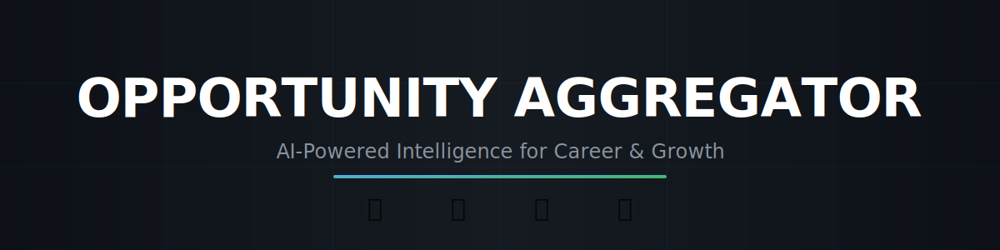
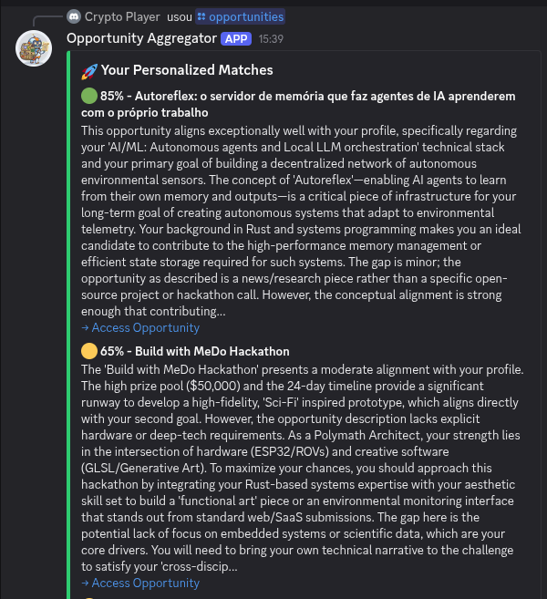
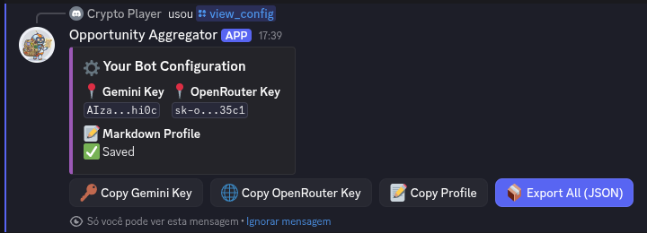
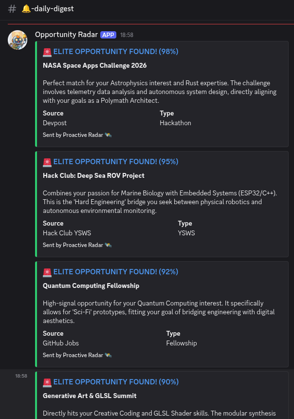

# Opportunity Aggregator 🚀

[](https://www.python.org/downloads/)
[](https://discord.com/)
[](https://aistudio.google.com/)
[](https://www.docker.com/)

A tool built to centralize and rank academic and tech opportunities. It automatically pulls data from various platforms and uses AI to find the best matches based on your specific profile.

## 🚌 Project Story
This project was developed in short bursts during daily bus commutes. The goal was to build something efficient that could turn a phone into a productive workstation, delegating the manual work of searching for hackathons and grants to an automated system.



## 🚀 Live Demo — Try it yourself!

**Join our Demo Server:** [Click here to join Discord](https://discord.gg/3HRV6G4G)

The bot is live in our Discord server. Use any command below:

| Command | What it does |
|:---|:---|
| `/opportunities` | Top 5 AI-ranked opportunities from live sources |
| `/hackclub` | Active YSWS programs + Hack Club events |
| `/analyze [text]` | Paste any text → instant AI fit score |
| `/models` | See available Gemini/OpenRouter models |

**Example:**
`/analyze text:Build a PCB and win free hardware from Hack Club`

> The bot fetches live data from **MLH, Devpost, TabNews, GitHub Jobs** and the **Hack Club API** (YSWS + Events), then ranks results using the **Gemini AI scorer** with automatic fallback to OpenRouter.
>
> In the background, the radar service runs every 6h and pushes **elite matches (>90%)** to Discord automatically via webhook — no command needed.

## Key Features

### 1. Data Sources

| Source | File | Used in |
|:---|:---|:---|
| MLH | `sources/mlh.py` | Bot + Radar |
| Devpost | `sources/devpost.py` | Bot + Radar |
| Hack Club YSWS + Events | `sources/hackclub.py` | Bot + Radar |
| TabNews | `sources/tabnews.py` | Bot + Radar |
| GitHub Jobs | `sources/github_jobs.py` | Bot + Radar |

### 2. Personalized Ranking (BYOK)
The system uses a **Bring Your Own Key** approach so you can scale your own usage:
*   **Markdown Profiles:** Users can upload their own .md files to define their skills and interests.
    *   *Need a starting point?* Check our [Profile Templates](PROFILES/):
        *   [🌐 Web Developer](PROFILES/web_developer.md)
        *   [🤖 AI/ML Expert](PROFILES/ai_ml_expert.md)
        *   [🛠️ Hardware Hacker](PROFILES/hardware_hacker.md)
        *   [🎓 Student Explorer](PROFILES/student_explorer.md)
*   **Fallback System:** It uses Gemini 3.1 Flash/Pro and automatically switches to OpenRouter (Llama/Gemma) if quotas are hit.
*   **Model Selection:** You can choose exactly which model you want to use via Discord commands.



### 3. Background Radar
The system operates using two main processes that run in parallel:
*   **Discord Bot:** The interface for commands and interactive queries.
*   **Background Radar:** A scheduled process that runs every 6 hours to sync new data and trigger alerts.



## ⌨️ Commands

| Command | Description |
| :--- | :--- |
| `/opportunities` | Syncs data and lists the Top 5 matches with AI rationales. |
| `/hackclub` | Panel for Hack Club events and active programs. |
| `/analyze` | Instant analysis for any pasted job or event text. |
| `/config_profile` | Upload your Markdown profile for matching. |
| `/config_model` | Select your AI provider and Model ID. |
| `/config_gemini` | Store your Gemini API Key. |
| `/config_openrouter` | Store your OpenRouter API Key. |
| `/view_config` | See your settings and export your data. |
| `/clear_config` | Delete specific settings or wipe your data. |
| `/models` | Check which AI models are currently available. |

## 🛠️ Tech Stack

*   **Language:** Python 3.11+
*   **Interface:** Discord.py (Slash Commands & Interactive Buttons)
*   **AI:** Google GenAI & OpenAI SDK (via OpenRouter)
*   **Database:** SQLite (Local storage with auto-migrations)
*   **Testing:** Unit and Mock tests using Pytest.


## 🚀 Deployment

### Docker (Recommended)
Docker-compose manages both the bot and the radar automatically:
```bash
docker-compose up -d --build
```

### Manual Setup
**Note:** You should run both commands in separate terminal sessions (or use background processes) to keep the bot and the radar active at the same time.

1. **Env:** `python -m venv .venv && source .venv/bin/activate`
2. **Deps:** `pip install -r requirements.txt`
3. **Run Bot:** `python bot.py`
4. **Run Radar:** `python main.py`

## 🛡️ Privacy
*   **Local Storage:** Your API keys and profiles stay in your own SQLite database.
*   **Private Messages:** Configuration commands use ephemeral messages (only you can see them).
*   **Full Control:** You can view or delete your data at any time.

---
**Developer:** EngThi | **Status:** Stable MVP v1.0
